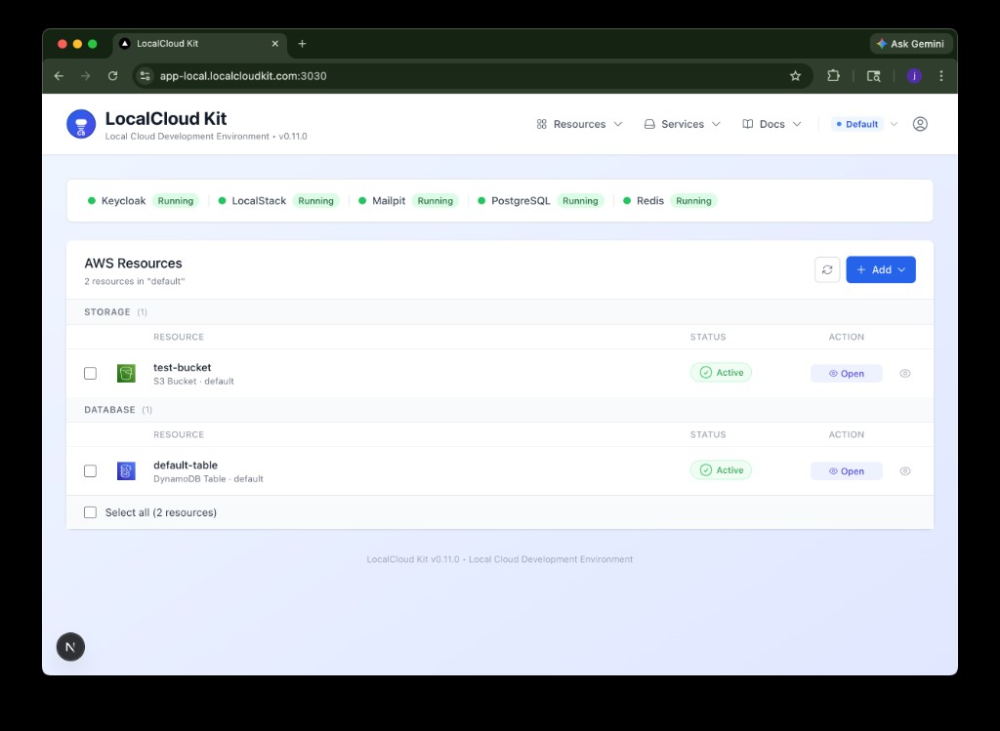
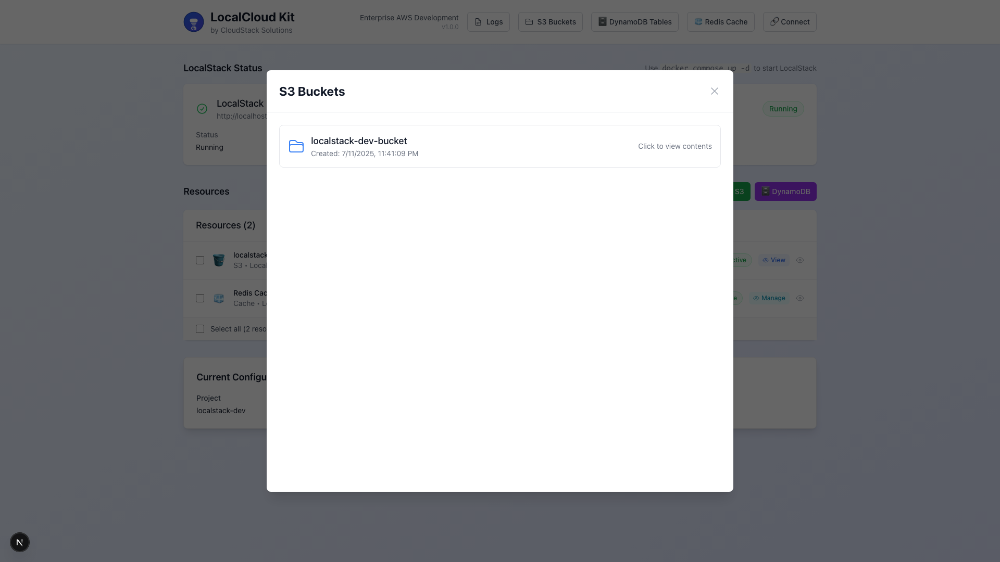

# LocalCloud Kit

> **Local AWS Development Environment**

Build and test cloud apps locally—no AWS account needed. Free, fast, and with full data visibility. Perfect for devs using S3, DynamoDB, and Secrets Manager.

[](https://github.com/jonbrobinson/localcloud-kit/releases/tag/v0.5.9)
[](LICENSE)
[](https://www.docker.com/)
[](https://localstack.cloud/)
[](https://nextjs.org/)
[](https://reactjs.org/)
[](https://www.typescriptlang.org/)
[](https://eslint.org/)
[](https://github.com/jonbrobinson/localcloud-kit)

## 🚀 Quick Start

### One Command Setup (Recommended)

```bash
# Start everything with one simple command
./start-gui.sh
```

This single command will:

- ✅ Install all dependencies automatically (handled by Docker)
- ✅ Start all Docker services
- ✅ Wait for services to be ready
- ✅ Display access URLs

**Access URLs:**

- **Web GUI**: http://localhost:3030
- **API Server**: http://localhost:3030/api
- **LocalStack**: http://localhost:4566

## 📸 Screenshots

### Main Dashboard

The main dashboard provides an overview of all LocalCloud Kit services and resources.



### S3 Bucket Management

Manage S3 buckets, upload files, and view bucket contents with syntax highlighting.



## 🏗️ Project Structure

```
localcloud-kit/
├── 📁 localcloud-gui/          # Next.js Web GUI
│   ├── 📁 src/
│   │   ├── 📁 components/      # React components
│   │   ├── 📁 services/        # API services
│   │   └── 📁 types/           # TypeScript types
│   └── 📄 README.md            # Web GUI documentation
├── 📁 localcloud-api/          # Express API Server
│   ├── 📄 server.js            # API server
│   ├── 📁 logs/                # Application logs
│   └── 📄 README.md            # API documentation
├── 📁 scripts/                 # Automation scripts
│   └── 📁 shell/               # Shell-based automation
│       ├── 📄 create_secret.sh # Secrets Manager creation
│       ├── 📄 delete_secret.sh # Secrets Manager deletion
│       ├── 📄 get_secret.sh    # Secrets Manager retrieval
│       └── 📄 list_secrets.sh  # Secrets Manager listing
├── 📁 samples/                 # Sample files for testing
│   ├── 📄 sample.py            # Python example
│   ├── 📄 sample.js            # JavaScript example
│   ├── 📄 sample.ts            # TypeScript example
│   ├── 📄 sample.json          # JSON example
│   ├── 📄 sample.csv           # CSV example
│   ├── 📄 Sample.java          # Java example
│   ├── 📄 sample.docx          # Word document example
│   └── 📄 README.md            # Samples documentation
├── 📄 docker-compose.yml       # Docker Compose configuration
├── 📄 Dockerfile.gui           # GUI container build
├── 📄 Dockerfile.api           # API container build
├── 📄 nginx.conf               # Reverse proxy configuration
├── 📄 start-gui.sh             # All-in-one startup script
└── 📄 README.md                # This file
```

## 🎯 Features

**Latest Release:** v0.5 series introduces AWS Secrets Manager integration, enhanced DynamoDB with GSI support, multipart file uploads, and Docker environment management. [View detailed changelog →](CHANGELOG.md)

### AWS Service Emulation

#### S3 Storage

- **Bucket Management**: Create, list, and delete S3 buckets with one-click operations
- **File Operations**: Upload, download, and delete objects with full GUI support
- **Multipart Uploads**: Handle large files up to 100MB with efficient memory management
- **File Viewer**: View files with syntax highlighting for 100+ languages
- **Document Support**: Preview Word documents, PDFs, images, and more
- **Nested Folders**: Full support for folder structures and nested paths

#### DynamoDB

- **Table Management**: Create and configure tables with custom schemas
- **Full CRUD Operations**: Add, view, update, and delete items
- **Global Secondary Indexes**: Complete GSI support with proper provisioning
- **Query & Scan**: Advanced querying with GSI support
- **Schema Validation**: Interactive forms for adding items with type checking

#### Secrets Manager

- **Secure Storage**: Store and manage secrets with encryption support
- **Mask/Reveal**: Toggle visibility of secret values for security
- **Rich Metadata**: Descriptions, tags, and KMS key encryption
- **ARN Management**: Copy ARNs for easy integration with applications
- **Bulk Operations**: Create, update, and delete multiple secrets

#### Redis Cache

- **Key-Value Storage**: Full Redis cache operations (set, get, delete, flush)
- **Cache Management**: View all keys and values with JSON formatting
- **Connection Info**: Easy integration with external Redis tools
- **GUI Interface**: Full-screen cache management interface

### Development Tools

#### Web Interface

- **Modern Dashboard**: Next.js-powered GUI with real-time updates
- **Resource Creation**: Individual or batch resource creation with templates
- **Live Monitoring**: Real-time status tracking and health checks
- **Log Viewer**: Stream logs with filtering and search capabilities
- **Hot Reloading**: Instant updates during development

#### Shell Automation

- **CLI Scripts**: Comprehensive shell scripts for all operations
- **Resource Templates**: Predefined configurations for common setups
- **Environment Management**: Support for dev, uat, and prod environments
- **Naming Conventions**: Consistent resource naming across environments
- **POSIX Compatible**: Works on macOS, Linux, and WSL

#### Docker Environment

- **Single Command Setup**: Start everything with `./start-gui.sh`
- **Docker Compose**: Fully containerized with hot reload support
- **Nginx Reverse Proxy**: Clean URL routing for all services
- **Environment Reset**: Easy cleanup and fresh start commands
- **Network Isolation**: Secure container networking
- **Volume Management**: Persistent data with easy cleanup options

### Developer Experience

- **Isolated Environment**: Complete isolation from AWS cloud - no account needed
- **Zero Cost**: Free local development without AWS charges
- **Fast Iteration**: No network latency - instant feedback on changes
- **Full Visibility**: Inspect and debug all data without restrictions
- **Cross-Platform**: Works on macOS, Linux, and Windows (WSL)
- **Comprehensive Documentation**: Detailed guides and SDK examples
- **Sample Files**: Pre-configured examples for testing features

## 🛠️ Prerequisites

- **Docker & Docker Compose**: For containerized services
- **AWS CLI**: For shell automation (optional, for local development)

## 📌 LocalStack Version Compatibility

LocalCloud Kit uses the latest LocalStack version by default:

- **Default Version**: `latest` (automatically pulls newest LocalStack release)
- **Last Tested**: 4.9 (October 12, 2025)
- **Compatibility**: Maintained and updated as LocalStack evolves

### Using Specific LocalStack Versions

The default configuration uses `latest`, but you can pin to a specific version if needed:

```bash
# Method 1: Using environment variable
LOCALSTACK_VERSION=4.0 docker compose up

# Method 2: Using Makefile
make start LOCALSTACK_VERSION=4.0

# Method 3: Create/edit .env file
echo "LOCALSTACK_VERSION=4.0" > .env
docker compose up

# Method 4: Edit env.example
cp env.example .env
# Edit LOCALSTACK_VERSION in .env
docker compose up
```

### Version Strategy

The `docker-compose.yml` uses `${LOCALSTACK_VERSION:-latest}` which means:

- Uses `latest` by default (automatically pulls newest LocalStack release)
- Ensures you always have the latest features and bug fixes
- Respects `LOCALSTACK_VERSION` environment variable for version pinning
- Flexibility to pin to specific versions when reproducibility is needed

**Why `latest`?**

- LocalCloud Kit is maintained to stay compatible with LocalStack updates
- Breaking changes are documented in the README when they occur
- Gives users the latest features and improvements automatically
- Can still pin to specific versions via environment variables if needed

> ⚠️ **Note**: If you encounter compatibility issues with a new LocalStack version, pin to a known working version (e.g., `4.9`) using the methods above, and report the issue in [GitHub Issues](https://github.com/jonbrobinson/localcloud-kit/issues).

## 📖 Usage

### Start Services

```bash
# Recommended: Use the startup script
./start-gui.sh

# Alternative: Docker Compose directly
docker compose up --build

# Alternative: Using Makefile
make start

# Development mode (GUI outside Docker)
docker compose up -d localstack api nginx
cd localcloud-gui && npm install && npm run dev
```

### Create Resources

#### Via Web GUI (Recommended)

1. Open http://localhost:3030
2. Click individual resource buttons:
   - 🪣 **S3 Bucket** - Create storage buckets
   - 🗄️ **DynamoDB Table** - Create NoSQL tables
   - 🔑 **Secrets Manager** - Store secrets
3. Or use the batch creation modal for multiple resources

#### Via Shell Scripts

```bash
# Batch resource creation
./scripts/shell/create_resources.sh localcloud-kit dev --s3 --dynamodb

# Individual resource creation
./scripts/shell/create_single_resource.sh s3 my-bucket
```

#### Via AWS CLI

```bash
# S3 bucket
aws --endpoint-url=http://localhost:4566 s3 mb s3://my-bucket

# DynamoDB table
aws --endpoint-url=http://localhost:4566 dynamodb create-table \
  --table-name my-table \
  --attribute-definitions AttributeName=id,AttributeType=S \
  --key-schema AttributeName=id,KeyType=HASH \
  --billing-mode PAY_PER_REQUEST

# Secrets Manager
aws --endpoint-url=http://localhost:4566 secretsmanager create-secret \
  --name my-secret \
  --secret-string "my-secret-value"
```

### Manage Resources

All resources can be managed through:

- **Web GUI**: http://localhost:3030
- **Shell Scripts**: Located in `scripts/shell/`
- **AWS CLI**: Using `--endpoint-url=http://localhost:4566`
- **AWS SDKs**: Configure with LocalStack endpoint

### Test File Viewer

Upload sample files to test syntax highlighting:

```bash
aws --endpoint-url=http://localhost:4566 s3 cp samples/sample.py s3://your-bucket/
aws --endpoint-url=http://localhost:4566 s3 cp samples/sample.js s3://your-bucket/
aws --endpoint-url=http://localhost:4566 s3 cp samples/sample.json s3://your-bucket/
```

Then view files in the GUI with full syntax highlighting support.

---

## 🔧 Configuration

### Service URLs

| Service     | URL                       | Description                |
| ----------- | ------------------------- | -------------------------- |
| Web GUI     | http://localhost:3030     | Main application interface |
| API Server  | http://localhost:3030/api | REST API endpoints         |
| LocalStack  | http://localhost:4566     | AWS services emulation     |
| Redis Cache | localhost:6380            | Redis cache (no password)  |

> **Note**: Within Docker network, services use internal hostnames (e.g., `localstack:4566`, `redis:6379`)

### Environment Configuration

- **Project Name**: Used for resource naming conventions
- **Environment**: Supports dev/uat/prod isolation
- **AWS Region**: Default is `us-east-1`
- **Hot Reload**: Enabled for both GUI and API during development

### Customization

Edit `docker-compose.yml` to customize:

- Port mappings
- Environment variables
- Resource limits
- Volume mounts

## 🚀 Common Commands

```bash
# Start services
docker compose up --build          # Build and start all services
./start-gui.sh                     # Recommended startup script
make start                         # Using Makefile

# View logs
docker compose logs -f             # Follow all logs
docker compose logs -f api         # Follow specific service

# Stop services
docker compose down                # Stop and remove containers
docker compose stop                # Stop without removing

# Restart services
docker compose restart             # Restart all
docker compose restart api         # Restart specific service

# Environment management
make reset                         # Stop services + clean volumes
make reset-env                     # Full reset (clean everything)
make clean-volumes                 # Clean data only
make clean-all                     # Nuclear option (remove all Docker resources)

# Production
docker compose up -d --scale api=3 # Scale services
```

> **⚠️ Note**: Destructive commands include confirmation prompts to prevent accidental data loss.

## 📚 Documentation

### Getting Started

- **[Quick Start Guide](QUICKSTART.md)** - Get up and running in minutes
- **[Docker Guide](DOCKER.md)** - Container deployment and management
- **[Connection Guide](CONNECT.md)** - AWS SDK integration examples

### Service Documentation

- **[Redis Cache Management](docs/REDIS.md)** - Complete Redis cache guide with API endpoints and examples
- **[Secrets Manager Integration](docs/SECRETS.md)** - Full Secrets Manager documentation with SDK examples

### Component Documentation

- **[API Documentation](localcloud-api/README.md)** - Backend API server reference
- **[GUI Documentation](localcloud-gui/README.md)** - Frontend application guide

## 🤝 Contributing

We welcome contributions! Please see our [Contributing Guide](CONTRIBUTING.md) for details.

### Development Setup

```bash
# Clone the repository
git clone https://github.com/jonbrobinson/localcloud-kit.git
cd localcloud-kit

# Start development environment
make start                  # Start all services with Docker
# or
docker compose up --build   # Alternative: Docker Compose directly

# View available commands
make help                   # Show all available Makefile commands

# Common development commands
make logs                   # View all service logs
make status                 # Check service health
make restart                # Restart all services

# GUI-only development (for frontend work)
make gui-start              # Start only GUI, API, and nginx
cd localcloud-gui && npm run dev  # Or run GUI locally outside Docker
```

## 📄 License

This project is licensed under the MIT License - see the [LICENSE](LICENSE) file for details.

## 🆘 Support

- **Documentation**: [README.md](README.md)
- **Issues**: [GitHub Issues](https://github.com/jonbrobinson/localcloud-kit/issues)
- **Discussions**: [GitHub Discussions](https://github.com/jonbrobinson/localcloud-kit/discussions)
- **Repository**: [GitHub Repository](https://github.com/jonbrobinson/localcloud-kit)

## 🔗 Links

- [GitHub Repository](https://github.com/jonbrobinson/localcloud-kit)
- [LocalStack Documentation](https://docs.localstack.cloud/)
- [AWS Documentation](https://docs.aws.amazon.com/)
- [Docker Documentation](https://docs.docker.com/)

---

## 📞 Contact

**LocalCloud Kit** - Open Source Project

- **GitHub**: https://github.com/jonbrobinson/localcloud-kit
- **Issues**: [GitHub Issues](https://github.com/jonbrobinson/localcloud-kit/issues)
- **Discussions**: [GitHub Discussions](https://github.com/jonbrobinson/localcloud-kit/discussions)
- **Documentation**: [README.md](README.md)

### Getting Help

- **Report Issues**: Use GitHub Issues for bug reports and feature requests
- **Ask Questions**: Use GitHub Discussions for questions and community support
- **Contribute**: Pull requests and contributions are welcome
- **Documentation**: Check the README and inline documentation

---

**Built with ❤️ for the developer community**

## 🛠️ Troubleshooting

### Connection Errors - "502 Bad Gateway" or "Failed to fetch"

If you're seeing connection errors when accessing the GUI:

**Check if services are running:**

```bash
docker compose ps                    # Check container status
docker compose up -d                 # Start if not running
```

**Verify services are healthy:**

```bash
curl http://localhost:3030/api/health           # Check API
curl http://localhost:4566/_localstack/health   # Check LocalStack
```

**Common solutions:**

- **502 Bad Gateway**: API server isn't running → `docker compose up -d`
- **Can't connect to LocalStack**: Wait for startup or restart → `docker compose restart localstack`
- **Port 3030 in use**: Stop conflicting service or change port in `docker-compose.yml`

**Development mode (GUI outside Docker):**

```bash
docker compose up -d localstack api nginx
cd localcloud-gui && npm install && npm run dev
# GUI available at http://localhost:3000
```

### Docker Build Failures - "No Space Left on Device"

If you encounter build failures with errors like:

```
failed to copy files: userspace copy failed: write /app/node_modules/...: no space left on device
```

This indicates that Docker has run out of disk space. This commonly happens when:

- **Multiple Docker builds** accumulate over time
- **Large node_modules** directories from previous builds
- **Unused Docker images, containers, and volumes** taking up space
- **Build cache** growing too large

#### Quick Fix - Clean Up Docker

**Using LocalCloud Kit Commands (Recommended):**

```bash
# Reset Docker environment (stops services + cleans volumes)
make reset

# Full environment reset (clean resources + stop services + clean all Docker resources)
make reset-env

# Clean Docker volumes only (removes all persistent data)
make clean-volumes

# Clean all Docker resources (containers, images, volumes)
make clean-all
```

**Using Docker Commands Directly:**

```bash
# Check Docker disk usage
docker system df

# Clean up everything (WARNING: This removes ALL unused Docker data)
docker system prune -a --volumes -f

# Alternative: Clean up specific components
docker image prune -a -f    # Remove unused images
docker container prune -f   # Remove stopped containers
docker volume prune -f      # Remove unused volumes
docker builder prune -a -f  # Remove build cache
```

#### Prevention - Regular Maintenance

Add these commands to your regular maintenance routine:

**Using LocalCloud Kit Commands:**

```bash
# Weekly reset (stops services + cleans volumes)
make reset

# Monthly deep cleanup (removes everything unused)
make reset-env

# Check space usage
docker system df
```

**Using Docker Commands Directly:**

```bash
# Weekly cleanup (keeps recent images)
docker system prune -f

# Monthly deep cleanup (removes everything unused)
docker system prune -a --volumes -f

# Check space usage
docker system df
```

#### What Causes This Issue

This issue is particularly common with this repository because:

1. **Large Dependencies**: Next.js and Node.js applications have large `node_modules` directories
2. **Multiple Builds**: Each `docker compose up --build` creates new layers
3. **Development Workflow**: Frequent rebuilds during development accumulate layers
4. **LocalStack Images**: The LocalStack Docker image is quite large (~1GB+)
5. **Build Cache**: Docker build cache can grow significantly over time

#### Monitoring Disk Usage

```bash
# Check current Docker disk usage
docker system df

# Expected output format:
# TYPE            TOTAL     ACTIVE     SIZE      RECLAIMABLE
# Images          10        3          2.1GB     1.5GB (71%)
# Containers      5         1          0.1GB     0.1GB (100%)
# Local Volumes   3         1          0.5GB     0.3GB (60%)
# Build Cache     0         0          0B        0B
```

If **RECLAIMABLE** space is high (>50%), consider running cleanup commands.

#### Alternative Solutions

If you frequently run into space issues:

1. **Use .dockerignore**: Ensure your `.dockerignore` file excludes unnecessary files
2. **Multi-stage builds**: Optimize Dockerfiles to reduce image size
3. **Regular cleanup**: Set up automated cleanup scripts
4. **Separate development**: Use different Docker contexts for different projects

---
