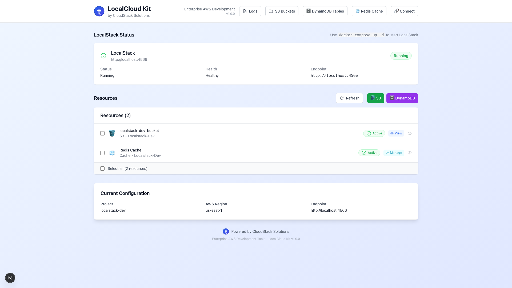

# LocalCloud Kit

> **Enterprise AWS Development Tools** by CloudStack Solutions

Build and test cloud apps locally—no AWS account needed. Free, fast, and with full data visibility. Perfect for devs using S3, DynamoDB, Secrets Manager, EventBridge, and more.

[](https://github.com/jonbrobinson/localcloud-kit/releases/tag/v0.4.0)
[](LICENSE)
[](https://www.docker.com/)
[](https://localstack.cloud/)
[](https://nextjs.org/)
[](https://reactjs.org/)
[](https://www.typescriptlang.org/)
[](https://eslint.org/)
[](https://cloudstack.solutions/)

## 🚀 Quick Start

### One Command Setup (Recommended)

```bash
# Start everything with one simple command
./start-gui.sh
```

This single command will:

- ✅ Install all dependencies automatically (handled by Docker)
- ✅ Start all Docker services
- ✅ Wait for services to be ready
- ✅ Display access URLs

**Access URLs:**

- **Web GUI**: http://localhost:3030
- **API Server**: http://localhost:3030/api
- **LocalStack**: http://localhost:4566

## 📸 Screenshots

### Main Dashboard

The main dashboard provides an overview of all LocalCloud Kit services and resources.



### S3 Bucket Management

Manage S3 buckets, upload files, and view bucket contents with syntax highlighting.


### Alternative Docker Setup

```bash
# Start everything with Docker Compose directly
docker compose up --build
```

This will start:

- **LocalCloud Kit Web GUI**: http://localhost:3030
- **LocalCloud Kit API Server**: http://localhost:3030/api
- **LocalStack**: http://localhost:4566
- **Nginx Reverse Proxy**: http://localhost:3030

### Alternative Startup Methods

#### Using Makefile

```bash
# Start all services
make start

# Start with GUI
make gui-start
```

#### Using Start Script

```bash
# Start with the original script (for development)
./start-gui.sh
```

## 🔧 Troubleshooting

### Getting "502 Bad Gateway" or "Failed to fetch" errors?

If you're seeing connection errors when accessing the GUI, it's likely because the backend services aren't running. Here's how to fix it:

#### 1. Check if Docker services are running

```bash
# Check Docker container status
docker compose ps

# If no containers are running, start them:
docker compose up -d
```

#### 2. Verify all services are healthy

```bash
# Check if the API is responding
curl http://localhost:3030/api/health

# Check if LocalStack is running
curl http://localhost:4566/_localstack/health
```

#### 3. Common Issues and Solutions

**Issue**: "Failed to fetch Geist" font error

- **Solution**: This has been fixed in the latest version. Pull the latest changes: `git pull origin main`

**Issue**: "502 Bad Gateway" when accessing GUI

- **Solution**: The API server isn't running. Start all services: `docker compose up -d`

**Issue**: GUI loads but can't connect to LocalStack

- **Solution**: Wait a moment for LocalStack to fully start, or restart: `docker compose restart localstack`

**Issue**: Port 3030 is already in use

- **Solution**: Stop other services using the port, or change the port in `docker-compose.yml`

#### 4. Development Mode

If you want to run the GUI locally (outside Docker) for development:

```bash
# Start the backend services first
docker compose up -d localstack api nginx

# Then run the GUI locally
cd localcloud-gui
npm install
npm run dev
```

The GUI will be available at http://localhost:3000 and will connect to the API at http://localhost:3030/api.

## 🏗️ Project Structure

```
localcloud-kit/
├── 📁 localcloud-gui/          # Next.js Web GUI
│   ├── 📁 src/
│   │   ├── 📁 components/      # React components
│   │   ├── 📁 services/        # API services
│   │   └── 📁 types/           # TypeScript types
│   └── 📄 README.md            # Web GUI documentation
├── 📁 localcloud-api/          # Express API Server
│   ├── 📄 server.js            # API server
│   ├── 📁 logs/                # Application logs
│   └── 📄 README.md            # API documentation
├── 📁 scripts/                 # Automation scripts
│   └── 📁 shell/               # Shell-based automation
│       ├── 📄 create_secret.sh # Secrets Manager creation
│       ├── 📄 delete_secret.sh # Secrets Manager deletion
│       ├── 📄 get_secret.sh    # Secrets Manager retrieval
│       └── 📄 list_secrets.sh  # Secrets Manager listing
├── 📁 samples/                 # Sample files for testing
│   ├── 📄 sample.py            # Python example
│   ├── 📄 sample.js            # JavaScript example
│   ├── 📄 sample.ts            # TypeScript example
│   ├── 📄 sample.json          # JSON example
│   ├── 📄 sample.csv           # CSV example
│   ├── 📄 Sample.java          # Java example
│   ├── 📄 sample.docx          # Word document example
│   └── 📄 README.md            # Samples documentation
├── 📄 docker-compose.yml       # Docker Compose configuration
├── 📄 Dockerfile.gui           # GUI container build
├── 📄 Dockerfile.api           # API container build
├── 📄 nginx.conf               # Reverse proxy configuration
├── 📄 start-gui.sh             # All-in-one startup script
└── 📄 README.md                # This file
```

## 🎯 Features

### What's New in v0.4.0

- **🔑 AWS Secrets Manager Integration**: Complete secrets management with secure value handling
- **📊 Dynamic Resource Display**: Smart resource list that shows/hides based on actual usage
- **🎨 Enhanced UI**: Better input styling and improved user experience
- **🔧 Improved Architecture**: Clean API routing and better error handling
- **📝 Comprehensive Documentation**: Updated guides and examples

### Core Automation

- **Individual Resource Creation**: Create resources one at a time or in batches
- **Shell Script Automation**: Fast, reliable command-line automation
- **Environment Management**: dev, uat, prod environments
- **Resource Templates**: Predefined common AWS setups
- **Naming Conventions**: Consistent resource naming across environments

### GUI Management

- **Web Interface**: Modern Next.js dashboard with hot reloading
- **Individual Resource Buttons**: Quick creation of S3, DynamoDB, Secrets Manager, Lambda, and API Gateway
- **Batch Resource Creation**: Create multiple resources at once with templates or individual selection
- **Real-time Monitoring**: Live status and resource tracking
- **Log Viewer**: Real-time log monitoring with filtering

### Containerization

- **Docker Compose**: Single command startup
- **Hot Reloading**: Development-friendly with live code updates
- **Reverse Proxy**: Clean URL routing with Nginx
- **Network Isolation**: Secure container networking

### Enterprise Features

- **Network Accessible**: Team collaboration ready
- **Professional Branding**: CloudStack Solutions design
- **Advanced Mode**: Detailed resource management
- **Universal Access**: Shell scripts work on any system

## 🛠️ Prerequisites

- **Docker & Docker Compose**: For containerized services
- **AWS CLI**: For shell automation (optional, for local development)

## 📖 Usage

### 1. Start All Services

```bash
# Using Docker Compose (recommended)
docker compose up --build

# Or using Makefile
make start
```

### 2. Create Resources

#### Individual Resource Creation (Recommended)

Use the web GUI to create resources individually:

- **S3 Bucket**: Click the 🪣 S3 button
- **DynamoDB Table**: Click the 🗄️ DynamoDB button
- **Secrets Manager**: Click the 🔑 Secrets button
- **Lambda Function**: Click the ⚡ Lambda button
- **API Gateway**: Click the 🌐 API Gateway button

#### Batch Resource Creation

```bash
# Using shell scripts (standard approach)
./scripts/shell/create_resources.sh localcloud-kit dev --s3 --dynamodb

# Or use predefined templates
./scripts/shell/create_resources.sh localcloud-kit dev --template basic
```

#### Via Web GUI

- Open http://localhost:3030
- Use individual resource buttons for quick creation
- Or use the resource creation modal for batch creation with templates

### 3. Manage via GUI

- Open http://localhost:3030
- Select resource template
- Create/destroy resources with one click

### 4. Test File Viewer

Upload sample files from the `samples/` directory to test the file viewer functionality:

```bash
# Upload sample files to test syntax highlighting
aws --endpoint-url=http://localhost:4566 s3 cp samples/sample.py s3://your-bucket-name/
aws --endpoint-url=http://localhost:4566 s3 cp samples/sample.js s3://your-bucket-name/
aws --endpoint-url=http://localhost:4566 s3 cp samples/sample.json s3://your-bucket-name/
aws --endpoint-url=http://localhost:4566 s3 cp samples/sample.docx s3://your-bucket-name/
```

Then view the files in the GUI to see syntax highlighting and document formatting in action.

## 🎨 GUI Features

### Web Interface (Next.js)

- **Real-time Dashboard**: Live LocalStack status
- **Resource Management**: Create/destroy with templates
- **Log Viewer**: Real-time logs with filtering
- **Network Accessible**: Team collaboration
- **Hot Reloading**: Instant code updates during development

## 🧊 Redis Cache Management

LocalCloud Kit now includes full Redis cache support for local development and testing.

### Features

- **Standalone Redis**: Runs as a container alongside LocalStack and the API
- **Full CRUD**: Set, get, delete, and flush cache keys
- **List All Keys**: View all keys and values in the cache
- **JSON-Aware**: Pretty-prints JSON values in the GUI
- **GUI Management**: Dedicated `/cache` page for full-screen cache management
- **Shell Scripts**: Automation scripts for cache operations
- **API Endpoints**: RESTful endpoints for cache management

### Docker Setup

- Redis runs as a service in `docker-compose.yml` (port 6380 on host, 6379 in container)
- No password by default (for local use)

### API Endpoints

- `GET /api/cache/status` — Check Redis status
- `POST /api/cache/set` — Set a key-value pair
- `GET /api/cache/get?key=...` — Get value by key
- `DELETE /api/cache/del` — Delete a key
- `POST /api/cache/flush` — Flush all keys
- `GET /api/cache/keys` — List all keys and values

### Shell Scripts

Located in `scripts/shell/`:

- `cache_set.sh`, `cache_get.sh`, `cache_del.sh`, `cache_flush.sh`, `list_cache.sh`, `list_cache_keys.sh`

### GUI Features

- **Dashboard**: Redis cache appears as a resource
- **Full-Page Management**: `/cache` page for all cache operations
- **Set/Get/Delete**: Action-based forms for each operation
- **Flush/Refresh**: Utility actions for cache
- **All Keys View**: See all keys/values, with pretty JSON formatting
- **Connection Info**: Shows host/port for external tools
- **Live Feedback**: Results and status are clearly displayed

### Usage Example

1. Start all services: `docker compose up --build`
2. Open the GUI: http://localhost:3030
3. Click "Redis Cache" in the dashboard or resource list
4. Use the full-page interface to set, get, delete, flush, and view all cache keys
5. Use the connection info to connect with external Redis tools (host: `localhost`, port: `6380`)

## 🔑 AWS Secrets Manager Integration

LocalCloud Kit now includes comprehensive AWS Secrets Manager support for secure secret management in local development and testing.

### Features

- **Complete CRUD Operations**: Create, read, update, and delete secrets
- **Secure Value Handling**: Mask/reveal secret values with toggle functionality
- **Rich Metadata Support**: Descriptions, tags, and KMS key encryption
- **Dynamic Resource Display**: Shows secrets count in resources list
- **Conditional Visibility**: Secrets resource only appears when secrets exist
- **GUI Management**: Dedicated Secrets Manager interface with full-screen management
- **Shell Scripts**: Automation scripts for all secrets operations
- **API Endpoints**: RESTful endpoints for programmatic access
- **Error Handling**: Comprehensive error handling and user feedback

### Docker Setup

- Secrets Manager runs as part of LocalStack services (enabled in `docker-compose.yml`)
- No additional configuration required - works out of the box

### API Endpoints

- `GET /api/secrets` — List all secrets
- `POST /api/secrets` — Create a new secret
- `GET /api/secrets/[secretName]` — Get secret details and value
- `PUT /api/secrets/[secretName]` — Update secret value and metadata
- `DELETE /api/secrets/[secretName]` — Delete a secret

### Shell Scripts

Located in `scripts/shell/`:

- `create_secret.sh` — Create a new secret with optional metadata
- `delete_secret.sh` — Delete a secret (with force delete option)
- `list_secrets.sh` — List all secrets with filtering
- `get_secret.sh` — Retrieve secret details and value

### GUI Features

- **Dashboard Integration**: Secrets Manager appears as a resource with dynamic count
- **Full-Screen Management**: Complete secrets management interface
- **Create/Edit Forms**: Rich forms with validation for secret creation and editing
- **Mask/Reveal Toggle**: Secure viewing of secret values
- **Tag Management**: Add, edit, and remove tags from secrets
- **KMS Encryption**: Support for KMS key encryption
- **Bulk Operations**: Delete multiple secrets with confirmation
- **Real-time Updates**: Live updates when secrets are modified

### Usage Example

1. Start all services: `docker compose up --build`
2. Open the GUI: http://localhost:3030
3. Click the "🔑 Secrets" button in the Resources section
4. Use the full-screen interface to:
   - Create new secrets with name, value, description, and tags
   - View existing secrets (values are masked by default)
   - Reveal/hide secret values with the eye icon
   - Edit secret values and metadata
   - Delete secrets with confirmation
   - Manage tags and KMS encryption

### Shell Script Examples

```bash
# Create a secret
./scripts/shell/create_secret.sh "my-secret" "secret-value" "My secret description" "Environment=dev,Team=backend" ""

# List all secrets
./scripts/shell/list_secrets.sh

# Get a specific secret
./scripts/shell/get_secret.sh "my-secret"

# Delete a secret
./scripts/shell/delete_secret.sh "my-secret" false
```

---

## 🔧 Configuration

### Docker Environment

The application runs entirely in containers with the following setup:

- **GUI**: Next.js app with hot reloading
- **API**: Express.js server with hot reloading
- **LocalStack**: AWS services emulation
- **Nginx**: Reverse proxy for clean routing

### URL Structure

- **Main Application**: http://localhost:3030
- **API Endpoints**: http://localhost:3030/api/\*
- **Health Check**: http://localhost:3030/health
- **LocalStack Health**: http://localhost:3030/localstack/health

> **Note**: The URLs above are for accessing the application from your host machine. Within the container network, services communicate using internal hostnames (e.g., `localstack:4566` for the API server to reach LocalStack).

### Project Configuration

- **Project Name**: Used for resource naming
- **Environment**: dev/uat/prod for isolation
- **AWS Region**: Target region for resources

## 📊 Resource Templates

Available templates for quick resource creation via GUI or CLI:

| Template          | Description                                          | Resources                         | CLI Example           |
| ----------------- | ---------------------------------------------------- | --------------------------------- | --------------------- |
| **Basic Setup**   | S3 bucket and DynamoDB table for basic storage needs | S3, DynamoDB                      | `--template basic`    |
| **Web App**       | Full web application stack with API Gateway          | S3, DynamoDB, Lambda, API Gateway | `--template webapp`   |
| **Data Pipeline** | Data processing pipeline with S3 and DynamoDB        | S3, DynamoDB, Lambda              | `--template pipeline` |
| **Custom**        | Create resources individually or with custom config  | Any combination                   | `--s3 --dynamodb`     |

## 🚀 Quick Commands

### Development

```bash
# Start all services
docker compose up --build

# View logs
docker compose logs -f

# Stop all services
docker compose down

# Restart specific service
docker compose restart localcloud-gui
```

### Production

```bash
# Start with production settings
docker compose -f docker-compose.yml -f docker-compose.prod.yml up -d

# Scale services
docker compose up -d --scale localcloud-api=3
```

## 📚 Documentation

- **[Quick Start Guide](QUICKSTART.md)** - Get up and running in minutes
- **[Docker Guide](DOCKER.md)** - Container deployment and management
- **[Connection Guide](CONNECT.md)** - AWS SDK integration examples
- **[API Documentation](localcloud-api/README.md)** - Backend API reference
- **[GUI Documentation](localcloud-gui/README.md)** - Frontend application guide

## 🤝 Contributing

We welcome contributions! Please see our [Contributing Guide](CONTRIBUTING.md) for details.

### Development Setup

```bash
# Clone the repository
git clone https://github.com/jonbrobinson/localcloud-kit.git
cd localcloud-kit

# Start development environment
docker compose up --build

# Run tests
make test

# Format code
make format
```

## 📄 License

This project is licensed under the MIT License - see the [LICENSE](LICENSE) file for details.

## 🆘 Support

- **Documentation**: [README.md](README.md)
- **Issues**: [GitHub Issues](https://github.com/jonbrobinson/localcloud-kit/issues)
- **Discussions**: [GitHub Discussions](https://github.com/jonbrobinson/localcloud-kit/discussions)
- **Email**: support@cloudstacksolutions.com

## 🔗 Links

- [CloudStack Solutions](https://cloudstacksolutions.com/)
- [LocalStack Documentation](https://docs.localstack.cloud/)
- [AWS Documentation](https://docs.aws.amazon.com/)
- [Docker Documentation](https://docs.docker.com/)

---

## 📞 Contact

**LocalCloud Kit** by CloudStack Solutions

- **Email**: info@cloudstacksolutions.com
- **Website**: https://cloudstacksolutions.com/
- **GitHub**: https://github.com/jonbrobinson/localcloud-kit
- **Documentation**: [README.md](README.md)

### Support & Services

- **Enterprise Support**: Custom deployments and consulting
- **Training**: AWS and LocalStack training programs
- **Development**: Custom automation and integration services
- **Copyright**: © 2024 CloudStack Solutions

---

**Built with ❤️ by CloudStack Solutions**

## 🛠️ Troubleshooting

### Shell Script Permission Denied (e.g., 'Permission denied' on create_single_resource.sh)

If you see errors like:

```
/bin/sh: ./create_single_resource.sh: Permission denied
```

This means the shell script does not have execute permissions inside the container. To fix:

1. **Grant execute permissions to all shell scripts:**
   ```sh
   chmod +x scripts/shell/*.sh
   git add scripts/shell/*.sh
   git commit -m "chore(scripts): ensure all shell scripts are executable"
   git push
   ```
2. **Rebuild your Docker containers:**
   ```sh
   docker compose build --no-cache
   docker compose up
   ```

> **Note:**
>
> - Git tracks the executable bit. If you commit scripts with `+x` permissions, they will retain those permissions across branches and repositories.
> - If you copy files outside of git (e.g., via zip or some editors), permissions may not be preserved.
> - On Windows, the executable bit may not be respected, but on macOS and Linux it is.

If you still see permission errors, you can also run this inside the running container:

```sh
docker exec localcloud-api chmod +x /app/scripts/shell/*.sh
```

### Docker Build Failures - "No Space Left on Device"

If you encounter build failures with errors like:

```
failed to copy files: userspace copy failed: write /app/node_modules/...: no space left on device
```

This indicates that Docker has run out of disk space. This commonly happens when:

- **Multiple Docker builds** accumulate over time
- **Large node_modules** directories from previous builds
- **Unused Docker images, containers, and volumes** taking up space
- **Build cache** growing too large

#### Quick Fix - Clean Up Docker

```bash
# Check Docker disk usage
docker system df

# Clean up everything (WARNING: This removes ALL unused Docker data)
docker system prune -a --volumes -f

# Alternative: Clean up specific components
docker image prune -a -f    # Remove unused images
docker container prune -f   # Remove stopped containers
docker volume prune -f      # Remove unused volumes
docker builder prune -a -f  # Remove build cache
```

#### Prevention - Regular Maintenance

Add these commands to your regular maintenance routine:

```bash
# Weekly cleanup (keeps recent images)
docker system prune -f

# Monthly deep cleanup (removes everything unused)
docker system prune -a --volumes -f

# Check space usage
docker system df
```

#### What Causes This Issue

This issue is particularly common with this repository because:

1. **Large Dependencies**: Next.js and Node.js applications have large `node_modules` directories
2. **Multiple Builds**: Each `docker compose up --build` creates new layers
3. **Development Workflow**: Frequent rebuilds during development accumulate layers
4. **LocalStack Images**: The LocalStack Docker image is quite large (~1GB+)
5. **Build Cache**: Docker build cache can grow significantly over time

#### Monitoring Disk Usage

```bash
# Check current Docker disk usage
docker system df

# Expected output format:
# TYPE            TOTAL     ACTIVE     SIZE      RECLAIMABLE
# Images          10        3          2.1GB     1.5GB (71%)
# Containers      5         1          0.1GB     0.1GB (100%)
# Local Volumes   3         1          0.5GB     0.3GB (60%)
# Build Cache     0         0          0B        0B
```

If **RECLAIMABLE** space is high (>50%), consider running cleanup commands.

#### Alternative Solutions

If you frequently run into space issues:

1. **Use .dockerignore**: Ensure your `.dockerignore` file excludes unnecessary files
2. **Multi-stage builds**: Optimize Dockerfiles to reduce image size
3. **Regular cleanup**: Set up automated cleanup scripts
4. **Separate development**: Use different Docker contexts for different projects

---
